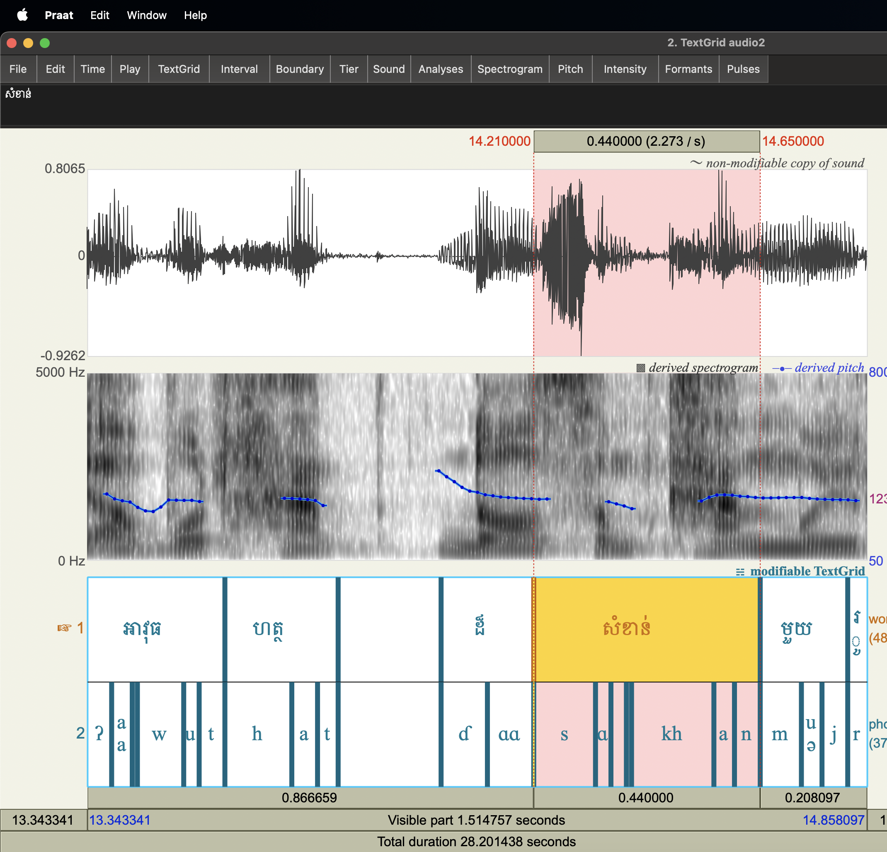

## Train an Acoustic Model for Khmer language with Montreal Forced Aligner

We'll use [[High quality TTS data for Khmer (OpenSLR 42)]](https://www.openslr.org/42/) dataset for training the acoustic model.

### 1. Create Conda Environment

```shell
conda create -n aligner python=3.8 --yes
conda activate aligner
```

### 2. Install MFA

```shell
conda install -c conda-forge montreal-forced-aligner --yes
```

### 3. Download the data

```shell
# audio dataset
wget -O km_kh_male.zip https://www.openslr.org/resources/42/km_kh_male.zip

# pronouncing dictionary
wget -O lexicon.txt https://github.com/seanghay/khmer-acoustic-model-mfa/raw/main/lexicon.txt

# uncompress
unzip km_kh_male.zip
```

### 4. Preprocess the dataset

Create transcription for each audio files.

```shell
python preprocess.py
```

### 5. Train

```shell
mfa train --clean --speaker_characters 8 km_kh_male/wavs lexicon.txt khm_model.zip 
```

This will take quite some time. Once it's done, there will be `khm_model.zip` file which you can then use for forced alignment.

[[Download Pretrained Model]](https://github.com/seanghay/khmer-acoustic-model-mfa/releases/download/1.0/khm_model.zip)

#### What is `--speaker_characters`?

Each audio file name looks like this `khm_0308_0011865648`

MFA requires speaker labels for speaker-adapted training (SAT), so basically `speaker_characters` argument is to tell MFA to slice and parse the file name (khm_0308_0011865648) 

It looks like this in Python

```python
speaker_characters = 8
file_name = "khm_0308_0011865648"
speaker_id = file_name[0:speaker_characters]
print(f"{speaker_id=}")
# => speaker_id=khm_0308"
```


### 6. Train G2P Model

The pronounciation dictionary `lexicon.txt` has a limited amount of words which will lead to out of vocabulary(OOV) error for missing words, so in order to be able to generate unseen words we have to train G2P model.

```shell
mfa train_g2p --phonetisaurus lexicon.txt khm_g2p.zip
```

[[Download G2P Model]](https://github.com/seanghay/khmer-acoustic-model-mfa/releases/download/1.0/khm_g2p.zip)

### 7. Forced Alignment

The output files will be in Praat TextGrid format.

```shell
mfa align --clean --speaker_characters 8 km_kh_male/wavs lexicon.txt khm_model.zip outputs
```

#### Align with sample audio

For some reason, without `--beam 100` the program crashes.

```shell
mfa align --clean --g2p_model_path khm_g2p.zip sample_audio lexicon.txt khm_model.zip sample_audio --beam 100
```

This will create `./sample_audio/audio.TextGrid`

---

Preview on [Praat: doing phonetics by computer](https://www.fon.hum.uva.nl/praat/) 




### References

- [Montreal Forced Aligner](https://montreal-forced-aligner.readthedocs.io/)
- [OpenSLR 42](https://openslr.org/42/)
- [google/language-resources](https://github.com/google/language-resources/blob/master/km/data/lexicon.tsv)
- https://eleanorchodroff.com/tutorial/montreal-forced-aligner.html